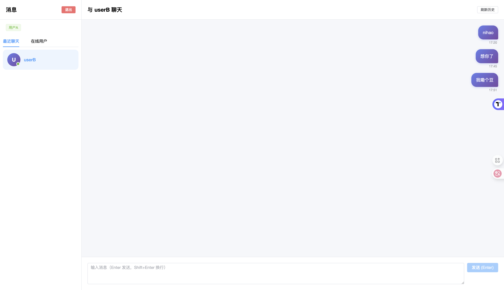

# 💬 IM 即时通讯系统

一个基于 Spring Boot + Vue 3 的现代化即时通讯系统，支持实时聊天、群聊、AI助手和全文搜索。

## ✨ 主要功能

- 💬 **实时聊天**：基于 WebSocket 的即时通讯
- 👥 **群组聊天**：支持创建群组、群聊天
- 🤖 **AI 助手**：集成 AI 对话功能
- 🔍 **消息搜索**：基于 Elasticsearch 的全文搜索
- 🔐 **用户认证**：登录/注册（Session + BCrypt 加密）
- 🟢 **在线状态**：实时显示用户在线状态
- 📱 **最近联系人**：智能排序的联系人列表
- ✅ **消息状态**：消息已读/未读状态追踪
- 💾 **消息持久化**：MySQL + Elasticsearch 双重存储
- 📴 **离线消息**：支持离线消息推送

## 🛠️ 技术栈

### 后端技术
- **框架**：Spring Boot 2.x
- **实时通信**：WebSocket (Spring WebSocket)
- **数据库**：MySQL 8.0
- **缓存**：Redis
- **会话管理**：Spring Session + Redis
- **ORM**：MyBatis
- **搜索引擎**：Elasticsearch
- **密码加密**：BCrypt
- **构建工具**：Maven

### 前端技术
- **框架**：Vue 3 (Composition API)
- **UI 组件库**：Element Plus
- **状态管理**：Pinia
- **路由**：Vue Router
- **HTTP 客户端**：Axios
- **构建工具**：Vite
- **WebSocket 客户端**：原生 WebSocket API

## 🚀 快速开始

### 1. 数据库配置

创建数据库并执行建表语句：

```sql
CREATE DATABASE im CHARACTER SET utf8mb4;

-- 用户表
CREATE TABLE t_user (
    id BIGINT PRIMARY KEY AUTO_INCREMENT,
    user_id VARCHAR(50) UNIQUE NOT NULL,
    password VARCHAR(255) NOT NULL,
    nickname VARCHAR(50),
    avatar VARCHAR(255),
    email VARCHAR(100),
    status TINYINT DEFAULT 1,
    created_at DATETIME,
    updated_at DATETIME
);

-- 消息表
CREATE TABLE t_message (
    id BIGINT PRIMARY KEY AUTO_INCREMENT,
    message_id VARCHAR(50) UNIQUE NOT NULL,
    from_user_id VARCHAR(50) NOT NULL,
    to_user_id VARCHAR(50) NOT NULL,
    content TEXT,
    message_type TINYINT DEFAULT 1,
    status TINYINT DEFAULT 0,
    created_at DATETIME
);

-- 群组表
CREATE TABLE `t_group` (
    id bigint NOT NULL AUTO_INCREMENT COMMENT '主键ID',
    group_id varchar(50) NOT NULL COMMENT '群组ID',
    group_name varchar(100) NOT NULL COMMENT '群组名称',
    creator_id varchar(50) NOT NULL COMMENT '创建者ID',
    avatar varchar(255) DEFAULT '' COMMENT '群头像',
    description varchar(500) DEFAULT '' COMMENT '群描述',
    member_count int DEFAULT '0' COMMENT '成员数量',
    status tinyint DEFAULT '1' COMMENT '状态：1-正常，0-已解散',
    created_at datetime DEFAULT NULL COMMENT '创建时间',
    updated_at datetime DEFAULT NULL COMMENT '更新时间',
);

-- 群组用户表
CREATE TABLE `t_group_member` (
    id bigint NOT NULL AUTO_INCREMENT COMMENT '主键ID',
    group_id varchar(50) NOT NULL COMMENT '群组ID',
    user_id varchar(50) NOT NULL COMMENT '用户ID',
    role varchar(20) DEFAULT 'member' COMMENT '角色：owner-群主，admin-管理员，member-普通成员',
    nickname varchar(50) DEFAULT '' COMMENT '群内昵称',
    joined_at datetime DEFAULT NULL COMMENT '加入时间',
)
```

### 2. 配置 Redis

确保 Redis 已安装并启动：
```bash
# macOS
brew install redis
brew services start redis

# Linux
sudo apt-get install redis-server
sudo systemctl start redis
```

### 3. 配置 Elasticsearch（可选）

如需使用消息搜索功能，请安装 Elasticsearch 7.x：
```bash
# macOS
brew install elasticsearch
brew services start elasticsearch

# Linux
wget https://artifacts.elastic.co/downloads/elasticsearch/elasticsearch-7.17.0-linux-x86_64.tar.gz
tar -xzf elasticsearch-7.17.0-linux-x86_64.tar.gz
cd elasticsearch-7.17.0/
./bin/elasticsearch
```

### 4. 后端配置

修改 `backend/src/main/resources/application.properties`：

```properties
# MySQL 配置
spring.datasource.url=jdbc:mysql://localhost:3306/im?useUnicode=true&characterEncoding=utf8mb4&serverTimezone=Asia/Shanghai
spring.datasource.username=root
spring.datasource.password=your_password

# Redis 配置
spring.redis.host=localhost
spring.redis.port=6379
spring.redis.password=

# Elasticsearch 配置（可选）
elasticsearch.host=localhost
elasticsearch.port=9200
```

### 5. 启动项目

**后端：**
```bash
cd backend
mvn spring-boot:run
```

**前端：**
```bash
cd frontend
npm install
npm run dev
```

访问：http://localhost:5173

## 📸 界面展示

### 聊天界面


**主要功能：**
- 👤 用户注册/登录
- 💬 实时发送/接收消息（Enter 发送，Shift+Enter 换行）
- 👥 群组管理（创建群组、查看群成员）
- 🤖 AI 智能助手对话
- 🔍 消息全文搜索
- 🟢 查看在线用户 / 最近联系人
- 📜 查看聊天历史
- ✅ 消息已读提示
- 📴 离线消息（用户上线后接收）
- 🕐 智能时间显示（今天/昨天/星期）

## 🎯 技术亮点

### 架构设计
- ✅ **前后端分离**：RESTful API + WebSocket 实时通信
- ✅ **会话管理**：Spring Session + Redis 分布式会话
- ✅ **无状态设计**：登出立即生效，无需 Token 黑名单
- ✅ **高可用性**：断线自动重连机制

### 数据存储
- ✅ **MySQL**：用户、消息、群组等核心数据持久化
- ✅ **Redis**：会话管理、在线状态、缓存
- ✅ **Elasticsearch**：消息全文搜索，支持高性能检索

### 安全性
- ✅ **密码加密**：BCrypt 单向加密
- ✅ **会话隔离**：Spring Session 安全管理
- ✅ **CORS 配置**：跨域请求安全控制
- ✅ **SQL 防注入**：MyBatis 参数化查询

### 用户体验
- ✅ **现代化 UI**：基于 Element Plus 的美观界面
- ✅ **实时反馈**：WebSocket 实时消息推送
- ✅ **智能提示**：输入状态、在线状态实时显示
- ✅ **响应式设计**：适配不同屏幕尺寸

## 📦 项目结构

```
im/
├── backend/                 # 后端项目
│   ├── src/main/java/
│   │   └── com/zyzyz/im/
│   │       ├── config/      # 配置类（WebSocket、Redis、Security等）
│   │       ├── controller/  # 控制器（Auth、Message、Group、AI、Search）
│   │       ├── service/     # 业务逻辑层
│   │       ├── mapper/      # MyBatis 数据访问层
│   │       ├── entity/      # 实体类
│   │       ├── dto/         # 数据传输对象
│   │       ├── handler/     # WebSocket 处理器
│   │       ├── manager/     # WebSocket 会话管理
│   │       └── repository/  # Elasticsearch 仓库
│   └── src/main/resources/
│       ├── application.properties
│       └── mapper/          # MyBatis XML 映射文件
│
└── frontend/                # 前端项目
    ├── src/
    │   ├── api/            # API 接口封装
    │   ├── components/     # Vue 组件
    │   ├── views/          # 页面视图
    │   ├── stores/         # Pinia 状态管理
    │   ├── router/         # 路由配置
    │   └── App.vue         # 根组件
    └── package.json
```

## 🔌 API 接口

### 认证接口
- `POST /api/auth/register` - 用户注册
- `POST /api/auth/login` - 用户登录
- `POST /api/auth/logout` - 用户登出
- `GET /api/auth/info` - 获取当前用户信息
- `PUT /api/auth/update` - 更新用户信息

### 消息接口
- `GET /api/messages/history` - 获取聊天历史
- `PUT /api/messages/{messageId}/read` - 标记消息为已读
- `GET /api/messages/unread-count` - 获取未读消息数

### 群组接口
- `POST /api/groups` - 创建群组
- `GET /api/groups` - 获取用户的所有群组
- `GET /api/groups/{groupId}` - 获取群组详情
- `GET /api/groups/{groupId}/members` - 获取群组成员

### AI 接口
- `POST /api/ai/chat` - AI 对话

### 搜索接口
- `GET /api/search/messages` - 搜索消息

### WebSocket 接口
- `ws://localhost:8080/ws` - WebSocket 连接

## 🛠️ 开发指南

### 后端开发
```bash
# 编译项目
mvn clean compile

# 运行测试
mvn test

# 打包
mvn clean package

# 跳过测试打包
mvn clean package -DskipTests
```

### 前端开发
```bash
# 安装依赖
npm install

# 开发模式
npm run dev

# 生产构建
npm run build

# 预览生产构建
npm run preview
```

## ❓ 常见问题

### 1. WebSocket 连接失败？
- 确保后端服务已启动
- 检查端口是否被占用（默认 8080）
- 确认 CORS 配置正确

### 2. Redis 连接失败？
- 确保 Redis 服务已启动：`redis-cli ping` 应返回 `PONG`
- 检查 Redis 配置是否正确

### 3. Elasticsearch 连接失败？
- 确保 Elasticsearch 服务已启动
- 访问 http://localhost:9200 检查状态
- 消息搜索功能是可选的，不影响基本聊天功能

### 4. 数据库连接失败？
- 确认数据库已创建：`CREATE DATABASE im CHARACTER SET utf8mb4;`
- 检查数据库用户名和密码
- 确认所有表已创建

## 🚀 未来计划

- [ ] 文件传输（图片、视频、文件）
- [ ] 语音/视频通话
- [ ] 消息撤回
- [ ] @提及功能
- [ ] 表情包支持
- [ ] 消息置顶
- [ ] 群组管理功能增强
- [ ] 移动端适配
- [ ] Docker 容器化部署
- [ ] 性能优化和压力测试

## 👨‍💻 贡献

欢迎提交 Issue 和 Pull Request！

## 📝 License

MIT
